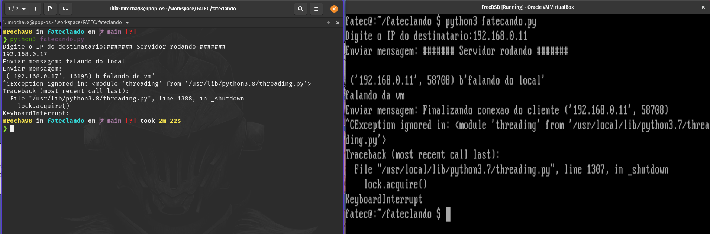

# Fateclando

Aplicativo de troca de mensagens TCP/IP com criptografia de ponta a ponta. Desenvolvido na disciplina Projeto de Banco de Dados Distribuídos (2020-2).

## Equipe

Alunos:

- Gabriel Pereira Bastos
- Matheus Rocha da Silva

Professor Diogo Branquinho

## Objetivo

Desenvolver em dupla um aplicativo de troca de mensagens TCP/IP com criptografia de ponta a ponta, ou seja, as
mensagens transmitidas devem ser criptografadas com criptografia do tipo Assimétrica.

Trabalho em dupla.

Cada aluno deve gerar a sua chave pública e chave privada, e realizar a troca da chave pública manualmente com
o seu colega. Depois disso, cada mensagem enviada deve ser criptografada com a chave pública do destinatário e
o destinatário deve descriptografar a mensagem com a sua chave privada de forma automática.

OBS: Exemplos encontram-se no <http://github.com/diogobranquinho>

## Demonstração

Na esquerda temos uma máquina local, na direita uma máquina virtual com conexão "Bridged Adapter".

O programa solicita o IP destinatário e estabelece uma conexão TCP.

Os usuários enviam mensagens e quando querem sair, pressionam CTRL+C.

## Como executar

- Instale a biblioteca rsa: `pip3 install rsa`
- Execute o script gerarChaves: `python3 gerarChaves.py`
- Troque a chave publica gerada com seu amigo (Ele deve te mandar a chave dele, e você manda a sua pra ele).
  - ATENÇÃO: A aplicação vai procurar pela chave publica do seu amigo na pasta do projeto, com o nome public.pem, porém, a sua chave tem o mesmo nome, então depois de enviar sua chave publica pra ele, altere o nome da sua chave, senão vai dar ruim.
- Certifique-se de que seu Firewall não está bloqueando a porta 20000
- Execute o script fateclando: `python3 fateclando.py`
- Informe o IP do seu amigo
- Envie mensagens
- Pressione Ctrl+C para finalizar a conexão
